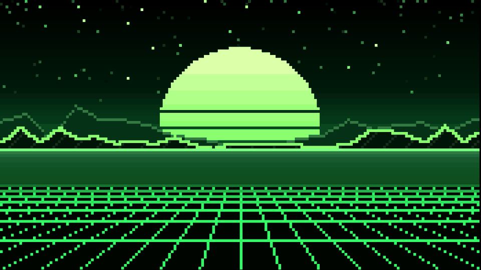
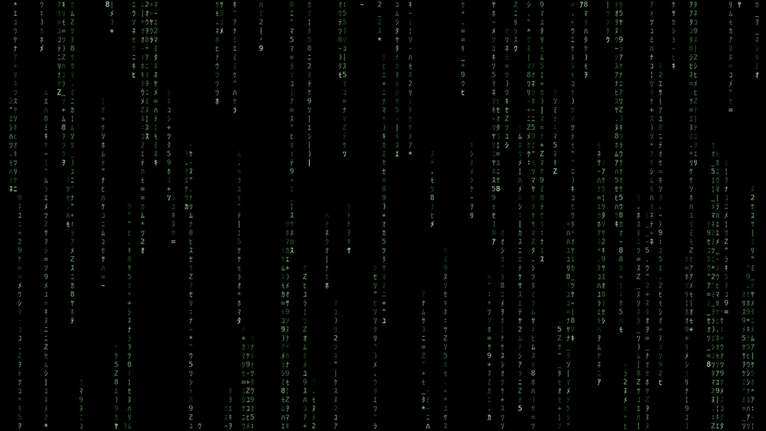
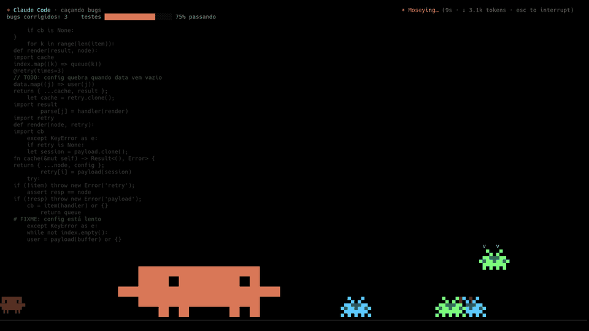
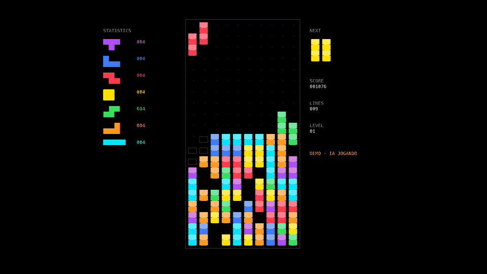
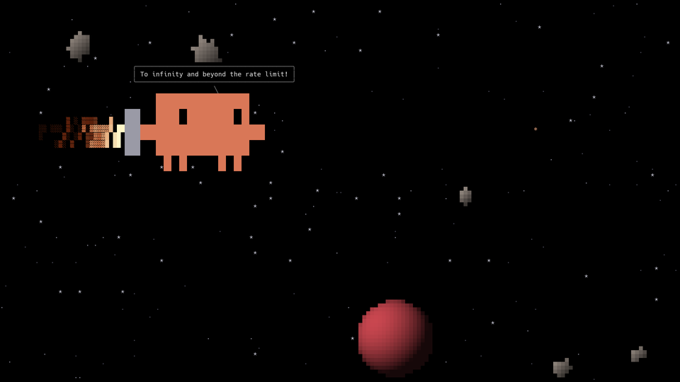

# screensaver-ascii

Um protetor de tela de terminal para **Linux no Wayland** (KDE Plasma 6 ou Hyprland) feito em Python puro: quando
o PC fica parado, um terminal em tela cheia (Konsole, Alacritty, kitty, ghostty, foot ou wezterm) abre e começa um
rodízio de 18 cenas animadas em ASCII e meio-bloco (`▀▄`), que se dissolvem umas nas outras com um efeito de glitch.
Mexeu no mouse ou no teclado, ele some.

Testado no Fedora + KDE + Konsole; feito pra funcionar também no **CachyOS** (KDE ou Hyprland) e no **Omarchy**
(veja [Distros e terminais](#distros-e-terminais)).

E, se você quiser (só no KDE), o mesmo rodízio vira um **vídeo de fundo na tela de bloqueio**.



| | |
|---|---|
|  |  |
|  |  |

## Cenas

| Cena | O que é |
|---|---|
| `Matrix` | chuva de katakana, claro |
| `Plasma` | plasma colorido clássico da demoscene |
| `Tunel` | túnel xadrez girando |
| `Estrelas` | campo de estrelas em warp |
| `Fogo` | fogo subindo do chão |
| `Ondas` | gotas caindo num lago escuro |
| `Vida` | Jogo da Vida de Conway |
| `Rosca` | o famoso donut 3D girando |
| `Hex` | "hacker" despejando hex e mensagens de filme |
| `Synthwave` | sol, montanhas e grade retrô |
| `Pokemon` | batalha no estilo FireRed/LeafGreen (precisa baixar os sprites, veja abaixo) |
| `Clawd` | o mascote do Claude Code caçando bugs no meio do código |
| `ClawdSoneca` | Clawd tirando um cochilo |
| `ClawdFesta` | Clawd na balada |
| `ClawdEspaco` | Clawd de jetpack no espaço |
| `Tetris` | Tetris jogando sozinho |
| `DVD` | o logo do DVD quicando (vai bater no canto?) |
| `Labirinto` | labirinto 3D em raycasting, estilo Wolfenstein |

Algumas cenas ainda podem vir **combinadas** (uma por cima da outra) e com paletas de cores sorteadas.

### Easter eggs

Tem. São raros, são bobos e são de gosto duvidoso — algo pode **voar** pela tela quando você menos espera.
Não vou estragar a surpresa; se não aguentar de curiosidade, rode com `SS_OVOS=1`.

## Requisitos

- Linux no Wayland com **KDE Plasma 6** ou **Hyprland** (outros compositores com `swayidle` devem funcionar)
- Um terminal com truecolor: **Konsole**, **Alacritty**, **kitty**, **ghostty**, **foot** ou **wezterm**
- `python3` (só biblioteca padrão para o screensaver em si)
- `swayidle` (KDE e outros) ou `hypridle` (Hyprland) pra saber quando o PC ficou parado
- Fonte **Hack Nerd Font Mono** (recomendada; sem ela usa Hack ou a monoespaçada padrão) — [nerdfonts.com](https://www.nerdfonts.com/font-downloads)
- Opcional, para a cena de Pokémon: Pillow (`python3-pillow` / `python-pillow` / `python3-pil`) e internet
- Opcional, só no KDE, para o vídeo da tela de bloqueio: Pillow, `ffmpeg` com `libx264` (no Fedora, o do RPM
  Fusion) e o plugin **Smart Video Wallpaper Reborn** (`sudo dnf install plasma-smart-video-wallpaper-reborn`)

O instalador descobre a distro (`pacman`, `dnf` ou `apt`), mostra o comando com os nomes certos dos pacotes que
faltam e **pergunta antes** de rodar qualquer `sudo`:

| | Arch / CachyOS / Omarchy | Fedora | Debian / Ubuntu |
|---|---|---|---|
| Python | `python` | `python3` | `python3` |
| Ociosidade | `swayidle` ou `hypridle` | `swayidle` | `swayidle` |
| Fonte | `ttf-hack-nerd` | (baixar do nerdfonts.com) | `fonts-hack` (Hack sem os ícones) |
| Pokémon | `python-pillow` | `python3-pillow` | `python3-pil` |
| Vídeo (KDE) | `ffmpeg` | `ffmpeg` do RPM Fusion | `ffmpeg` |

## Distros e terminais

| Onde | Como fica |
|---|---|
| **Fedora + KDE** | o original: Konsole com os perfis `Screensaver`/`ScreensaverMini`, `swayidle` via systemd, bloqueio do KDE |
| **CachyOS + KDE** | igual ao Fedora (Konsole + `swayidle`); `sudo pacman -S swayidle ttf-hack-nerd` |
| **CachyOS + Hyprland** | o terminal que tiver (Alacritty, kitty…), disparado pelo `hypridle` |
| **Omarchy** | Alacritty (ou Ghostty) + `hypridle`, no lugar do screensaver que vem com o Omarchy (veja abaixo) |
| Outros | qualquer terminal da lista + `swayidle` (se o compositor tiver *ext-idle-notify*) |

O terminal é escolhido pelo `screensaver-iniciar`: no KDE, o Konsole (se tiver); fora dele, o primeiro que achar
entre `alacritty`, `kitty`, `ghostty`, `foot` e `wezterm`. Pra forçar um, ponha `SCREENSAVER_TERMINAL=kitty` no
ambiente (ou no comando do hypridle/swayidle). A janela abre em tela cheia, opaca, sem bordas, fundo preto, fonte 14
(~174x49 células em 1080p; mude com `SCREENSAVER_FONTE=12`) e com a classe/app-id **`screensaver-ascii`** (no
ghostty é `io.github.screensaver-ascii`, porque lá precisa ser um ID de aplicativo GTK).

### A cena de Pokémon em cada terminal

A batalha roda na resolução do GBA, então precisa de uma grade de pelo menos **240x80 células** (240x160 "pixels"
com meio-bloco). Em 1080p com fonte 14 o terminal tem ~174x49, então o screensaver **diminui a fonte** só durante
essa cena (passando por uma tela preta) e volta depois. Quem não sabe trocar a fonte com o programa rodando só mostra
a cena se o terminal já for grande o bastante; senão ela é pulada.

| Terminal | Pokémon em tela cheia? | Como |
|---|---|---|
| Konsole | sim | troca pro perfil `ScreensaverMini` via D-Bus (veja "Access denied" abaixo) |
| kitty | sim | `kitty @ set-font-size` (o `screensaver-iniciar` abre o kitty com `allow_remote_control` e um socket só dele) |
| Alacritty ≥ 0.13 | sim | `alacritty msg config font.size=N` pelo socket de IPC (vem ligado por padrão) |
| ghostty, foot, wezterm | só se já couber | sem troca de fonte em tempo real; use uma fonte menor (`SCREENSAVER_FONTE=8`) ou uma tela maior (4K) |

No kitty e no Alacritty o tamanho é calculado na hora: ele estima a fonte que dá 240x80, mede e vai descendo meio
ponto até caber.

### Hyprland / CachyOS com Hyprland

Rodando `./instalar.sh` dentro do Hyprland, o gatilho padrão é o **hypridle** (o `swayidle` também funciona:
`./instalar.sh --swayidle`, mas o serviço depende do `graphical-session.target`, que só existe se a sessão usa
`uwsm`). O instalador pergunta se pode adicionar isto no fim do `~/.config/hypr/hypridle.conf`:

```ini
# >>> screensaver-ascii
listener {
    timeout = 150
    on-timeout = ~/.local/bin/screensaver-iniciar
    on-resume = ~/.local/bin/screensaver-parar
}
# <<< screensaver-ascii
```

Depois reinicie o hypridle (`killall hypridle; hyprctl dispatch exec hypridle`, ou
`systemctl --user restart hypridle` se ele roda como serviço). O bloqueio continua sendo o seu (`hyprlock`, no
listener de `lock_cmd`/`loginctl lock-session`): deixe o tempo dele maior que 150 s. Quando o `hyprlock` (ou
`swaylock`) está rodando, o screensaver sai sozinho e nem abre.

Os terminais já pedem tela cheia sozinhos, mas se quiser garantir (e tirar transparência/animação), o instalador
também oferece estas regras no `~/.config/hypr/hyprland.conf`:

```ini
windowrulev2 = fullscreen, class:^(.*screensaver-ascii)$
windowrulev2 = noanim, class:^(.*screensaver-ascii)$
windowrulev2 = opacity 1.0 override 1.0 override, class:^(.*screensaver-ascii)$
```

(Versões mais novas do Hyprland mudaram a sintaxe de regras de janela; se aparecer erro de config, adapte pra
sintaxe da sua versão.) O `--desinstalar` tira os blocos marcados com `# >>> screensaver-ascii`.

### Omarchy

O Omarchy já vem com um screensaver próprio (o `omarchy-launch-screensaver`, que abre um terminal rodando efeitos do
`tte`, *terminal text effects*) chamado pelo hypridle no mesmo tempo de 150 s. Pra usar este no lugar:

1. `./instalar.sh` (de dentro do Hyprland) e responda **s** pra adicionar o listener no `hypridle.conf`.
2. Quando ele avisar do `omarchy-launch-screensaver`, responda **s** pra comentar aquele listener (as linhas ganham
   o prefixo `# (screensaver-ascii) ` e o `--desinstalar` desfaz). Ou faça na mão: em `~/.config/hypr/hypridle.conf`
   comente o bloco `listener { … on-timeout = pidof hyprlock || omarchy-launch-screensaver }`.
3. Reinicie o hypridle. O Alacritty do Omarchy já tem o socket de IPC, então a cena de Pokémon troca a fonte sozinha.

Atualizações do Omarchy podem reescrever o `hypridle.conf`; se o screensaver dele voltar (ou o nosso sumir), rode o
instalador de novo.

## Instalação

```bash
git clone https://github.com/AdolfoCarneiro/screensaver-ascii.git
cd screensaver-ascii
./instalar.sh               # o básico
./instalar.sh --pokemon     # + baixa os sprites da cena de Pokémon
./instalar.sh --bloqueio    # + vídeo na tela de bloqueio
```

O instalador pode rodar quantas vezes quiser. Ele copia:

| Arquivo | Para |
|---|---|
| `screensaver-ascii`, `screensaver-iniciar`, `screensaver-parar` | `~/.local/bin/` |
| `baixar-pokemon.py` | `~/.local/share/screensaver-ascii/` |
| `konsole/*` (perfis `Screensaver`, `ScreensaverMini` e o esquema de cores preto), só se tiver Konsole | `~/.local/share/konsole/` |
| `systemd/screensaver.service` (e, com `--bloqueio`, `screensaver-video.*`) | `~/.config/systemd/user/` |

e liga o `screensaver.service` (swayidle) ou, no Hyprland, adiciona o listener no `hypridle.conf` (perguntando antes).
`--hypridle` / `--swayidle` forçam um ou outro.

## Uso

Depois de instalado não precisa fazer nada: é só largar o PC. Para testar na hora (qualquer tecla fecha):

```bash
~/.local/bin/screensaver-iniciar                          # o terminal que ele escolher
SCREENSAVER_TERMINAL=kitty ~/.local/bin/screensaver-iniciar   # um terminal específico
```

Opções úteis (rodando dentro de um terminal qualquer):

| Opção | O que faz |
|---|---|
| `--cena Nome` | fixa uma cena só (ex.: `--cena Tetris`) |
| `--proxima Nome` | força qual vai ser a próxima cena |
| `--bench` | mede quantos ms cada cena gasta por quadro |
| `--video SAIDA.mp4 --minutos N` | grava o rodízio num vídeo 1920x1080 (sem precisar de terminal) |
| `SS_DURACAO=5` | cada cena dura 5 s (bom pra ver tudo rápido) |
| `SS_OVOS=1` | modo demo dos easter eggs |
| `SS_DEBUG=1` | mostra no stderr por que ele saiu |

Exemplo: `SS_DURACAO=6 screensaver-ascii --cena Clawd`.

## Como funciona

- O `screensaver.service` roda `swayidle -w timeout 150 screensaver-iniciar resume screensaver-parar` (no
  Hyprland, o listener do hypridle faz o mesmo). Ou seja: **2min30** parado, abre o terminal em tela cheia (no
  Konsole, com o perfil `Screensaver`); mexeu, fecha. O PID fica em `$XDG_RUNTIME_DIR/screensaver.pid`.
- O **bloqueio de tela continua sendo do KDE** (ou do `hyprlock` no Hyprland), no tempo que estiver em *Configurações › Tela de bloqueio*
  (deixe maior que 2min30, senão bloqueia antes do screensaver aparecer). Quando a tela bloqueia, o screensaver
  percebe (via `org.freedesktop.ScreenSaver` no KDE, ou vendo um processo `hyprlock`/`swaylock`) e sai sozinho.
- Os tempos de desligar a tela/suspender ficam em *Configurações › Energia*; ajuste do seu jeito.
- Com `--bloqueio` (só KDE), a tela de bloqueio usa o plugin Smart Video Wallpaper Reborn tocando
  `~/.local/share/screensaver-ascii/bloqueio.mp4` em loop. O instalador grava isso no `~/.config/kscreenlockerrc`
  com `kwriteconfig6`. Sempre que o screensaver entra e o vídeo tem mais de 20h, um vídeo novo é gerado em
  prioridade mínima (`screensaver-video.service`). Também dá para usar o timer diário:
  `systemctl --user enable --now screensaver-video.timer`.

### "Access denied" do Konsole (é normal)

A cena de Pokémon roda na resolução do GBA, então durante ela o screensaver troca a fonte do Konsole para o perfil
`ScreensaverMini` via D-Bus (`org.kde.konsole.Session.setProfile`). O Konsole responde **`AccessDenied`** (essa API
fica marcada como "sensível" e desligada), **mas aplica a troca mesmo assim**. O programa confirma pela mudança de
tamanho do terminal e ignora o erro. Se a troca não acontecer, a cena é pulada.

## Pokémon: sprites baixados por você

Nenhum sprite vem neste repositório. O `baixar-pokemon.py` (rodado por `./instalar.sh --pokemon`) baixa os sprites
de FireRed/LeafGreen dos 151 de Kanto da [PokeAPI](https://pokeapi.co/) **na sua máquina** e monta o cache
`~/.local/share/screensaver-ascii/pokemon.json`. Sem esse arquivo, a cena simplesmente não entra no rodízio.

## Desinstalar

```bash
./instalar.sh --desinstalar
rm -rf ~/.local/share/screensaver-ascii   # sprites e vídeo, se quiser
```

Se usou `--bloqueio`, escolha outro fundo em *Configurações › Tela de bloqueio*.

Na mão: `systemctl --user disable --now screensaver.service screensaver-video.timer`, apague os arquivos da tabela
de instalação e tire os blocos `# >>> screensaver-ascii` do `hypridle.conf`/`hyprland.conf`.

## Aviso

Projeto de fã, sem fins lucrativos. **Não é afiliado, patrocinado ou endossado** pela Nintendo, Game Freak,
Creatures Inc. ou The Pokémon Company, nem pela Anthropic. Pokémon e seus personagens são marcas das respectivas
donas; Claude, Claude Code e o Clawd são da Anthropic. O código é MIT (veja `LICENSE`); isso não cobre nenhum
material de terceiros que o script baixa.

---

## English

**screensaver-ascii** is a terminal screensaver for Wayland (KDE Plasma 6 or Hyprland), in pure Python. After 2.5
minutes idle, `swayidle` (or `hypridle`) opens a fullscreen terminal that cycles through 18 animated ASCII/half-block scenes (Matrix,
plasma, tunnel, starfield, fire, ripples, Game of Life, spinning donut, hacker hex, synthwave, a FireRed-style
Pokémon battle, four Claude Code mascot scenes, self-playing Tetris, bouncing DVD logo, raycaster maze) with glitchy
dissolve transitions. Any input closes it. Optionally the same show is rendered into a video and used as the
lock-screen background via the Smart Video Wallpaper Reborn plugin. There are rare, silly easter eggs
(`SS_OVOS=1` to see them).

Install: `./instalar.sh` (`--pokemon` downloads sprites from PokeAPI on your own machine; `--bloqueio` sets up the
KDE-only lock-screen video; `--hypridle`/`--swayidle` pick the idle trigger; `--desinstalar` removes it). The
installer detects pacman/dnf/apt and offers the right package names (it always asks before running `sudo`).
Requires `python3`, `swayidle` or `hypridle`, and one of Konsole, Alacritty, kitty, ghostty, foot or wezterm
(`SCREENSAVER_TERMINAL=…` forces one; the window class/app-id is `screensaver-ascii`). Hack Nerd Font Mono is
recommended. Code and comments are in Portuguese.

**Distros:** Fedora + KDE is the tested setup. CachyOS with KDE works the same way (Konsole + swayidle). On Hyprland
(CachyOS or **Omarchy**) the installer appends a `listener { timeout = 150; on-timeout = ~/.local/bin/screensaver-iniciar;
on-resume = ~/.local/bin/screensaver-parar }` block to `~/.config/hypr/hypridle.conf`, and on Omarchy it offers to
comment out the built-in `omarchy-launch-screensaver` listener so both don't start at once. It exits when
`hyprlock`/`swaylock` is running.

**Pokémon scene:** it needs a ≥240x80 cell grid, so the font is shrunk during that scene: Konsole switches profile
over D-Bus, kitty uses `kitty @ set-font-size`, Alacritty ≥ 0.13 uses `alacritty msg config font.size=N`. ghostty,
foot and wezterm can't change the font live, so the scene only plays if the terminal is already big enough.

Fan project, not affiliated with Nintendo, Game Freak, The Pokémon Company or Anthropic. No sprites are
distributed here. MIT licensed.
